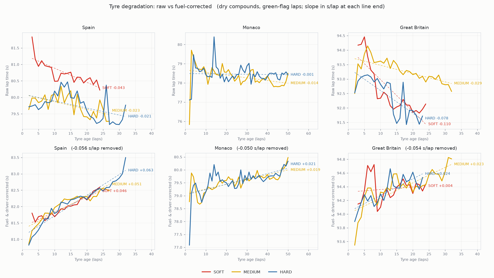
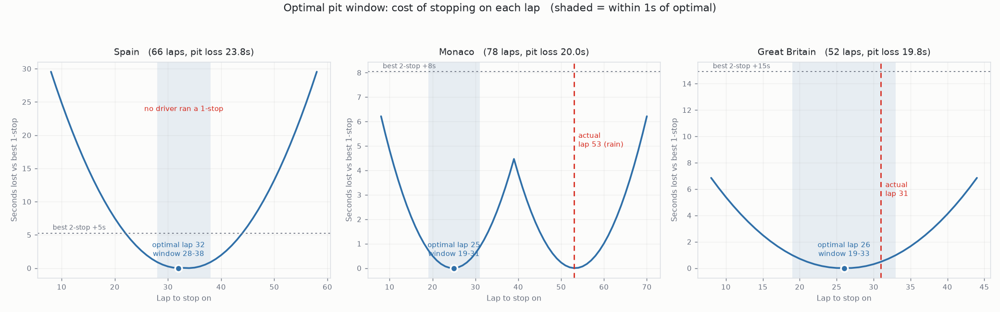

# F1 Tyre Degradation & Optimal Pit Window

Real F1 timing data (via [FastF1](https://github.com/theOehrly/Fast-F1)) run through
a full pipeline — ingest, clean, model, optimise — to answer one question per
circuit: **given how the tyre degrades here, when should the car pit, and how does
that compare to what teams actually did?**

Three 2023 races, picked for strategic variety: Spain (high degradation), Monaco
(low degradation, street circuit), Silverstone (high degradation + a safety car).

## Headline finding

Raw lap times *fall* as a tyre ages — fuel burn (~0.05 s/lap) outweighs
degradation and points the other way, so every number below comes from a
regression that separates the two first. Once separated:

**Spain degrades ~2.5x faster than Silverstone, and Silverstone shows no
measurable difference between compounds at all** — not the textbook
soft-medium-hard ordering, but a real result once you account for the fact that
race data never contains an equal-effort comparison between compounds.



Feeding those degradation rates into a pit-window optimiser (traded against a
pit-loss cost measured from real stops) recovers the paddock's actual strategy
at Silverstone — model optimum lap 26 vs. an actual median of lap 31 — and at
Spain correctly flags *why* its own answer shouldn't be trusted: the model's
preferred 1-stop plan requires a 32-lap stint on softs, five laps longer than
any soft stint ever run at that circuit.



Full writeup: **[report/findings.md](report/findings.md)**.

## Pipeline

| Stage | What | Where |
|---|---|---|
| 1. Ingest | Pull lap-by-lap timing via FastF1 | [`extract.py`](extract.py) |
| 2. Clean | Drop in/out laps, non-green laps, rain-affected laps, per-stint outliers | [`clean.py`](clean.py) |
| 3. Degradation model | Separate fuel burn from tyre wear via regression | [`notebooks/analysis.ipynb`](notebooks/analysis.ipynb) |
| 4. Pit-window model | Optimal stop lap per circuit, actual vs. model | same notebook |
| 5. SQL | Same data queried in SQLite | [`sql/`](sql/) |
| 6. Report | Findings in plain language + figures | [`report/`](report/) |

## Setup

```
pip install -r requirements.txt

python extract.py          # -> raw_laps.csv   (downloads via FastF1, cached in f1_cache/)
python clean.py             # -> clean_laps.csv
python sql/build_db.py      # -> sql/f1.db      (optional, for the SQL layer)

jupyter notebook notebooks/analysis.ipynb
```

`raw_laps.csv`, `clean_laps.csv`, and `sql/f1.db` are all regenerable from the
scripts above and are not committed.

## Limitations

Public timing data only, no team telemetry; degradation is fit as a straight
line and can't see a tyre "cliff"; three races demonstrate the method, not a
season-wide claim. Full list in [report/findings.md](report/findings.md).
